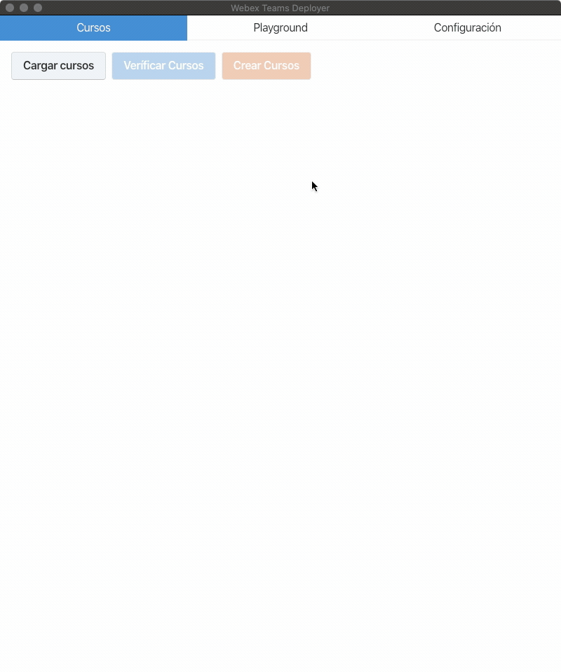

Webex Teams Deployer
===

Aplicación creada para automatizar la creación de "Teams" en Webex Teams.

Configuración
---

Antes de empezar, es necesario obtener el token de desarrollador desde la página de [Cisco Webex For Developers](https://developer.webex.com/docs/api/getting-started). Utilizaremos este token para interactuar con la API. El mismo solo estará valido por 12h.

Luego, debemos seleccionar la carpeta de trabajo, y los archivos CSV donde esta almacenada la información. En total, necesitamos cargar 3 archivos:

- Un archivo CSV con los cursos
- Un archivo CSV con los docentes por curso
- Un archivo CSV con los estudiantes por curso

El formato de cada uno de estos archivos es el siguiente:

### Archivo CSV de cursos

- `nombre_curso`: Nombre del curso

### Archivo CSV de Docentes

- `nombre_curso`: Nombre del curso al cual hace referencia.
- `codigo_persona`: Identificador único de la persona.
- `primer_apellido`: Nombre o primer apellido de la persona.
- `primer_nombre`: Segundo o primer apellido de la persona.

Todos estos pasos los hacemos dentro de la pestaña `Configuración`. No olvide grabar los cambios antes de salir de la pestaña.

Playground
---

El `Playground` permite probar el funcionamiento de la API, y veríficar el funcionamiento de la misma.

**Tenga cuidado al interactuar con esta pestaña, dado que estará interactuando directamente con los recursos de su cuenta.**

Cursos
---

En esta pestaña se desarrolla la creación de los cursos. Primero, debemos cargar la información de los archivos haciendo clicke en el boton `Cargar Cursos`.

Luego, debemos validar que estos cursos no existan actualmente. Para esto, podemos hacer click en `Validar Cursos` para validar todos los cursos, o podemos hacer click en el boton de validación individual.

La creación de cursos solo se puede hacer tras el proceso de validación.

Para crear, es necesario hacer click en el boton `Crear Cursos` o en el boton individual de cada curso.

Este procedimiento evita la duplicación de recursos.

Al finalizar el procedimiento, podrá ver el estado de todos los cursos. Se utiliza un juego de color para indicar el estado de los recursos:

- `azul`: el recurso no se ha validad todavía.
- `rojo`: el recurso no existe.
- `verde`: el recurso fue creado correctamente.